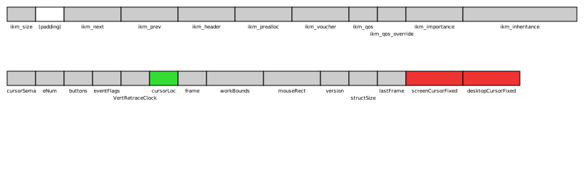

_Siguza, 10. Oct 2017_

# IOHIDeous

"IOHIDFamily once again."

## Introduction

This is the tale of a macOS-only vulnerability in IOHIDFamily that yields kernel r/w and can be exploited by any unprivileged user.

IOHIDFamily has been notorious in the past for the many race conditions it contained, which ultimately lead to large parts of it being rewritten to make use of command gates, as well as large parts of it being locked down by means of entitlements. I was originally looking through its source in the hope of finding a low-hanging fruit that would let me compromise an iOS kernel. I didn't know it then, but some parts of IOHIDFamily exist only on macOS - specifically `IOHIDSystem`, which contains the vulnerability discussed herein.

The exploit accompanying this write-up consists of three parts:

-   `poc` (`make poc`)  
    Targets all macOS versions, crashes the kernel to prove the existence of a memory corruption.
-   `leak` (`make leak`)  
    Targets High Sierra, just to prove that no separate KASLR leak is needed.
-   `hid` (`make hid`)  
    Targets Sierra and High Sierra, achieves full kernel r/w and disables SIP to prove that the vulnerability can be exploited by any unprivileged user on all recent versions of macOS.

Note: The `ioprint` and `ioscan` utilities I'm using in this write-up are available from my [`iokit-utils`](https://github.com/Siguza/iokit-utils) repository. I'm also using my [hsp4 kext][hsp4] along with [kern-utils](https://github.com/Siguza/ios-kern-utils) to inspect kernel memory.

Also for any kind of questions or feedback, feel free to hit me up on [Twitter](https://twitter.com/s1guza) or via mail (`*@*.net` where `*` = `siguza`).

## Technical background

In order to understand the attack surface as well as the vulnerability, you need to know about the involved parts of IOHIDFamily. It starts with the [`IOHIDSystem`](TODO) class and the UserClients it offers. There are currently three of those:

- `IOHIDUserClient`
- `IOHIDParamUserClient`
- `IOHIDEventSystemUserClient`

(There used to be a fourth, `IOHIDStackShotUserClient`, but that has been commented out for a while now.) Like almost all UserClients in IOHIDFamily these days, `IOHIDEventSystemUserClient` requires an entitlement to be spawned (`com.apple.hid.system.user-access-service`), however the other two do not. `IOHIDParamUserClient` can actually be spawned by any unprivileged process, but of interest to us is `IOHIDUserClient`, arguably the most powerful of the three, which during normal system operation is held by `WindowServer`:

    bash$ ioprint -d IOHIDUserClient
    IOHIDUserClient(IOHIDUserClient): (os/kern) successful (0x0)
    <?xml version="1.0" encoding="UTF-8"?>
    <!DOCTYPE plist PUBLIC "-//Apple//DTD PLIST 1.0//EN" "http://www.apple.com/DTDs/PropertyList-1.0.dtd">
    <plist version="1.0">
    <dict>
        <key>IOUserClientCreator</key>
        <string>pid 144, WindowServer</string>
        <key>IOUserClientCrossEndianCompatible</key>
        <true/>
    </dict>
    </plist>

This is an important point because as it turns out, IOHIDSystem restricts the amount of `IOHIDUserClient`s that can exist at the same time to one. This is specifically enforced by the `evOpenCalled` class variable, which is set to `true` when an `IOHIDUserClient` is spawned and to `false` again when it is closed. This variable is checked in `IOHIDSystem::evOpen`, which in turn is called from `IOHIDSystem::newUserClientGated` (i.e. we can't even race it).

Bottom line, there can only be one `IOHIDUserClient` at any given moment, and chances are that when your code runs, `WindowServer` will be up and running with its UserClient already. So snatching that is not straightforward, but we'll get to that later. For now we're gonna look at what it actually uses that UserClient for.

`IOHIDSystem`/`IOHIDUserClient` offer some shared memory for an event queue that `WindowServer` can map into its address space via `clientMemoryForType`. This memory is split into three parts packed after each other in this order:

-   The `EvOffsets` structure.  
    This structs holds information about where the other parts of the shared memory are located in respect to the beginning of the shared memory (so they're given as offsets). The definition is:

    ```c
    typedef volatile struct _evOffsets {
        int evGlobalsOffset;    /* Offset to EvGlobals structure */
        int evShmemOffset;      /* Offset to private shmem regions */
    } EvOffsets;
    ```

-   The `EvGlobals` structure.  
    This is where the actual event queue resides, and this makes up 99% of the shared memory. I'll omit the lengthy declaration here, you can view it in [`IOHIDShared.h`](TODO) or see my annotated version in [`data/evg.c`](TODO).
-   Private driver memory.  
    As far as I can see, this remains unused and has a size of 0 bytes.

In `IOHIDSystem`, the extensively used `EvGlobals` address is assigned to an `evg` variable, and although unused, the address of the private driver memory is assigned to an `evs` variable.

To initialise that memory, `IOHIDSystem` offers a `createShmem` function which `IOHIDUserClient` implements as external method 0. Like pretty much any IOHIDFamily interface these days, `IOHIDSystem::createShmem` is neatly gated to prevent any concurrent access, and the real implementation resides in `IOHIDSystem::createShmemGated`. On Sierra and earlier that function actually allocated the shared memory if necessary, but since High Sierra (or IOHIDFamily version 1035.1.4) that duty has been shifted to `IOHIDSystem::init`. Regardless, all code paths eventually end up at `IOHIDSystem::initShmem`, which is responsible for cleaning and initialising the actual data structures.

And that's where it gets interesting.

## The vulnerability

This is the beginning of `IOHIDSystem::initShmem`, which contains the vulnerability:

```c++
int  i;
EvOffsets *eop;
int oldFlags = 0;

/* top of sharedMem is EvOffsets structure */
eop = (EvOffsets *) shmem_addr;

if (!clean) {
    oldFlags = ((EvGlobals *)((char *)shmem_addr + sizeof(EvOffsets)))->eventFlags;
}

bzero( (void*)shmem_addr, shmem_size);

/* fill in EvOffsets structure */
eop->evGlobalsOffset = sizeof(EvOffsets);
eop->evShmemOffset = eop->evGlobalsOffset + sizeof(EvGlobals);

/* find pointers to start of globals and private shmem region */
evg = (EvGlobals *)((char *)shmem_addr + eop->evGlobalsOffset);
evs = (void *)((char *)shmem_addr + eop->evShmemOffset);
```

Can you spot it? What if I told you that this function can be called with the shared memory already mapped in the calling task, and that `EvOffsets` is declared as `volatile`? :P

The thing is that between this line:

```c++
eop->evGlobalsOffset = sizeof(EvOffsets);
```

and this one:

```c++
evg = (EvGlobals *)((char *)shmem_addr + eop->evGlobalsOffset);
```

The value of `eop->evGlobalsOffset` can change, which will then cause `evg` to point to somewhere other than intended.

From looking [at the source](TODO), this vulnerability seems to have been present ever since the kext's original release back in 2002.

## Putting the exploit together

The fun part. :P

### Getting access

Before we can do anything else, we have to look at how we can actually get access to thing we wanna play with, i.e. how we can spawn an `IOHIDUserClient` when `WindowServer` is holding the only available, and is there before us.

The first option I implemented was to just get `WindowServer`'s task port and "steal" its client with `mach_port_extract_right`. Works like a charm, the only problem is that this requires you to be root, and SIP to be disabled.

The next lower option is to simply `kill -9 WindowServer`. Still requires root, but at least that works with SIP fully enabled. `WindowServer` goes down, its UserClient gets cleaned up and we have plenty of time to spawn our own. As a side effect, you'll also notice the system's entire graphical interface going down along with `WindowServer` - so we're not exactly stealthy at this point.

I did some more digging and found that `WindowServer` actually lets go of its UserClient for a few seconds when a user logs out - more than enough time for us to grab it. So finally we have something that doesn't require us to run as root, but merely as the currently logged-in user, since we can easily force a logout with:

    launchctl reboot logout

But can we go lower? Can we do this as any unprivileged user? TL;DR: Yes we can!  
First, we can try with some AppleScript trickery. `loginwindow` implements something called "AppleEventReallyLogOut" or "aevtrlgo" for short, which attempts to log the user out without a confirmation dialogue. For reasons of general insanity, `loginwindow` does not seem to verify where this event is coming from, so any unprivileged account such as, say, `nobody`, can get away with this:

    osascript -e 'tell application "loginwindow" to «event aevtrlgo»'

Now, it doesn't work quite as flawlessly as the previous method. It acts as if the user had actually chosen to log out via the GUI - which means that apps with unsaved changes can still abort the logout, or at least prompt for confirmation (an example for this is Terminal with a running command). In contrast, `launchctl` just tears down your GUI session without letting anyone say a damn thing. (Another drawback is that we cannot test the success of `aevtrlgo`, since the call returns while the confirmation popup is still active. This seems like a limitation of AppleScript.)

But second, alternatively to a logout, a shutdown or reboot will do as well. This makes for an interesting possibility: we could write a sleeper program and just _wait_ for conditions to become favourable - I have no access to any statistics, but I'd assume most Macs are _eventually_ shut down or rebooted manually, rather than only ever going down as the result of a panic. And if that assumption holds, then our sleeper will get the chance to run and snatch the UserClient it needs.

So in order to maximise our success rate, we do the following:

1. Install signal handlers for `SIGTERM` and `SIGHUP`. This should buy us at least a few seconds after a logout/shutdown/reboot has been initiated.
2. Run `launchctl reboot logout`.
3. If the former failed, run `osascript -e 'tell application "loginwindow" to «event aevtrlgo»'`.
4. Try spawning the desired UserClient repeatedly. Whether we succeeded in logging the user out doesn't matter at this point, we'll just wait for a manual logout/shutdown/reboot if not. So as long as the return value of `IOServiceOpen` is `kIOReturnBusy`, we keep looping.

_This is implemented in [`src/hid/obtain.c`](TODO) with some parts residing in [`src/hid/main.c`](TODO)._

### Triggering the bug

With access secured, we can now get to triggering our bug. It's obvious that we _can_ be lucky enough to modify `eop->evGlobalsOffset` just in the right moment - but how likely is that, and what can go wrong? There are three possible outcomes:

- We lose the race, i.e. `evg` is set to what it should be.
- We win the race, manage to offset `evg`, and `evg` now points to a data structure we placed on the heap.
- We win the race, but `evg` lands in something other than we intended.

The last case will probably cause a panic sooner (unmapped memory) or later (corruption of some data structure). Luckily I've had this happen only very rarely. Because of that, and because we cannot repair any such corruption anyway, we're just gonna focus on the other two cases. The first one is undesirable but unproblematic (we can just try again), and the second one is the one we want. Thanks to the initialisation performed by `IOHIDSystem`, we can even detect which of those happened: first the entire shared memory (with the correct address) is `bzero`'ed, and afterwards many fields are set (with the offset address), some of which hold a constant value `!= 0`. After calling the initialisation routine, we can query any such field and if it holds `0`, `evg` was offset, otherwise we failed. I chose the `version` field in my implementation.

In conclusion:

- In one thread, we just spam a value to `eop->evGlobalsOffset`.
- In another thread, we call the initialisation routine until `evg->version == 0`.

_This is implemented in [`src/hid/exploit.c`](TODO). A minimal standalone implementation also exists in [`src/poc/main.c`](TODO)._

### Shmem basics

Now that we can trigger our memory corruption, what exactly can we do with it? First we'll look at how big of a corruption we can actually cause. `eop->evGlobalsOffset` is of type (signed) `int`, so we can offset `evg` by `INT_MAX` bytes in either direction. That's quite a lot.

Next we'll look at the structure's size. Since it's exported to userland, we can just include an IOKit header and do some `sizeof`:

```c
// gcc -o t t.c -Wall -framework IOKit
#include <stdio.h>
#include <IOKit/hidsystem/IOHIDShared.h>

int main(void)
{
    printf("0x%lx\n", sizeof(EvOffsets) + sizeof(EvGlobals));
    return 0;
}
```

From Sierra 10.12.0 through High Sierra 10.13.0, that yields `0x5ae8`. That's also quite a lot... in other words, we can slap one monster of a memory structure an entire two gigabytes back and forth through memory (that's what inspired the name "IOHIDeous").

Now, a priori we know neither where this structure resides, nor where any other kernel memory lies in respect to it. So far we only know that it is allocated via an `IOBufferMemoryDescriptor`, which for `kIOMemoryKernelUserShared` goes through `iopa_alloc`, and subsequently maps the memory into the provided task, if any - in this case the `kernel_task`, so the mapping ends up on the `kernel_map`. Knowing its sharing type and (rounded) size, we can easily find it with `kmap`:

    bash$ sudo kmap -e | fgrep 24K | fgrep 'mem tru'
    ffffff8209855000-ffffff820985b000     [  24K] -rw-/-rwx [mem tru cp] 0000000000000000 [0 0 0 0 0] 00000031/823e0c11:<         4> 0,0 {         6,         6} (dynamic)

Running this a couple of times on Sierra yields addresses like:

    ffffff91ec867000
    ffffff91f3ec2000
    ffffff91f48f3000
    ffffff91f6a2c000
    ffffff91f828a000
    ffffff91fc02a000
    ffffff91fe160000
    ffffff91fe6b3000
    ffffff91ffc8a000
    ffffff9209150000
    ffffff92103a8000
    ffffff9211be0000
    ffffff9213141000
    ffffff9215c04000
    ffffff921a2ce000
    ffffff921bf03000

And on High Sierra:

    ffffff8116089000
    ffffff8119735000
    ffffff812a681000
    ffffff81ec925000
    ffffff81efedd000
    ffffff82005cd000
    ffffff820383d000
    ffffff8205531000
    ffffff82096c0000

Those look like arbitrary locations on the heap, which doesn't give us much. In order to do further statistics, we need to know what we're looking for. It seems extremely unlikely that we can find some structure with a fixed offset from our shared memory, so our best bet is most likely to make a lot of allocations, which might give us a _chance_ of an allocated structure appearing at a fixed offset... so let's look at where allocations go. The prime kernel memory allocator used by virtually all of IOKit is `kalloc`. Allocations smaller or equal to two page sizes (`0x2000` on x86(_64), `0x8000` on arm(64)), are passed on to `zalloc` with a corresponding `kalloc.X` zone handle. Allocations larger than two page sizes to go the `kalloc_map` first, and if that becomes full, directly to the `kernel_map` (allocations _a lot_ larger than two page sizes go directly to the `kernel_map`, but that doesn't affect us here).  
So we've got two possible targets: the `kalloc_map` and the `kernel_map`.

We'll first look at the `kernel_map` - that is, the entire virtual address space of the kernel. Unlike the zalloc zones, maps employ no freelists, so allocations can happen practically anywhere. However, unless explicitly told not to, the `vm_map_*` functions (through which both `kalloc` and `IOMemoryDescriptor` go) always put an allocation in the lowest free address gap that is large enough. This doesn't just mean that it's likely that allocations we make are placed next to each other, but also that our shared memory was mapped in the same manner, and that the further we offset from it, the more likely an address is to still be free (so we could spray there). On Sierra that translates quite nicely into practice, but on High Sierra I found this way barred by the fact that my own allocations would happen at `ffffff92...` addresses while the shared memory resided around `ffffff82...`. I tracked this back mainly to a 64GB large mapping between the two:

    bash$ sudo kmap -e | fgrep '64G'
    ffffff820c115000-ffffff920c355000     [  64G] -rw-/-rwx [map prv cp] ffffff820c115000 [0 0 0 0 0] 0000000e/82656611:<         2> 0,0 {         0,         0} VM compressor

As is evident from its tag, this monster map belongs to the virtual memory compressor. It also exists on Sierra, but there our shared memory sits _after_ it whereas on High Sierra it sits _before_ it. This is most likely the result of `IOHIDSystem` allocating the shared memory in `IOHIDSystem::init` now, which is called much earlier than `IOHIDSystem::createShmem` ever could be. So, `kernel_map`: hot for Sierra, not for High Sierra.

What about the `kalloc_map` then? This is a submap of the `kernel_map` with a fixed size, specifically a 32nd of the physical memory size (i.e. 16GB -> 512MB). On Sierra it is identifiable by its exact size and the fact that it is a `map`, while on High Sierra it even got its own tag:

    bash$ sudo kmap -e | fgrep 'Kalloc'
    ffffff81bca61000-ffffff81dca61000     [ 512M] -rw-/-rwx [map prv cp] ffffff81bca61000 [0 0 0 0 0] 0000000d/66b19131:<         2> 0,0 {         0,         0} Kalloc

Now that address looks like it could well be in range of our shared memory! I've done a couple of probes across reboots, and have sorted them by the distance between the kalloc map and our shared memory, for memory sizes of 8GB and 16GB:

    10.13 8G
    shmem               kalloc start        kalloc end          start diff          end diff
    ffffff812a681000    ffffff80f0cd4000    ffffff8100cd4000    00000000399ad000    00000000299ad000
    ffffff8116089000    ffffff80dc695000    ffffff80ec695000    00000000399f4000    00000000299f4000
    ffffff8119735000    ffffff80dfd24000    ffffff80efd24000    0000000039a11000    0000000029a11000

    10.13 16G
    shmem               kalloc start        kalloc end          start diff          end diff
    ffffff82096c0000    ffffff81bc97c000    ffffff81dc97c000    000000004cd44000    000000002cd44000
    ffffff8205531000    ffffff81b87ec000    ffffff81d87ec000    000000004cd45000    000000002cd45000
    ffffff82005cd000    ffffff81b37e5000    ffffff81d37e5000    000000004cde8000    000000002cde8000
    ffffff81ec925000    ffffff819fb38000    ffffff81bfb38000    000000004cded000    000000002cded000
    ffffff820383d000    ffffff81b6a48000    ffffff81d6a48000    000000004cdf5000    000000002cdf5000
    ffffff81efedd000    ffffff81a30df000    ffffff81c30df000    000000004cdfe000    000000002cdfe000

Nice, all differences are less than the 2GB we can offset! (Note that the kalloc addresses are lower than the shmem ones, so 1. the differences are negative and 2. we're really lucky to have our offset value `signed`. :P) I've done the same statistics on Sierra as well (see [`data/shmem.txt`](TODO)), but there all differences are larger than 64GB (as is to be expected). So on High Sierra we'll go for the `kalloc_map`.

Now that we have our targets set, we can look at how to maximise the chance of landing in a structure sprayed by us. On both maps, allocations usually happen at the lowest possible address, so the higher an address, the less likely it should be to have been previously allocated, i.e. the more likely it should be to be allocated by us.

So, for Sierra/the `kernel_map`:

1. Fill the `kalloc_map`.
2. Make >2GB worth of allocations on the `kernel_map`.
3. Offset `evg` by 2GB.
4. Read or corrupt the structure at that offset.

And for High Sierra/the `kalloc_map`:

1. Fill the `kalloc_map`.
2. Offset `evg` by ca. `-0x30000000`.
3. Read or corrupt the structure at that offset.

Notes:

- `sysctlbyname("hw.memsize")` returns the system memory size, from which the size of the `kalloc_map` can be derived. 
- The value `-0x30000000` is a bit arbitrary. In order to land inside the `kalloc_map`, we need a negative offset that is larger than the biggest possible difference between the end of the `kalloc_map` and the beginning of our shared memory, but which is also smaller than the smallest possible difference between the _beginning_ of the `kalloc_map` and the beginning of our shared memory. Ideally it should also be as small as possible, so that we land closer to the end of the map. With biggest and smallest observed differences being `-0x2cdfe000` and `-0x399ad000`, I have chosen `-0x30000000` as a conservative guess. It is most likely possible to derive a more fitting value based on the actual memory size (which seems to affect the differences) by doing a lot more statistics, but I eventually grew tired of rebooting, and `-0x30000000` works just fine for me (you can change `KALLOC_OFFSET_AMOUNT` in [`src/hid/config.h`](TODO) if you like a different value better).
- Making 2GB worth of allocations takes well over 10 minutes on my machine, which is longer than I like to wait. I have found that allocating just 768MB and offsetting by a little bit less than that still worked every time for me though. I have added both configurations to [`src/hid/config.h`](TODO) with the 768MB being the default, and the 2GB one being selectable through a `-DPLAY_IT_SAFE` compiler flag.

### Reading and writing memory

First of all, we have the general problem that we don't know whether offsetting `evg` by a certain amount places it at the beginning of a sprayed memory structure or somewhere in the middle. We do know that allocations start at page boundaries though (including our shared memory), are rounded up to a multiple of the page size, and must be bigger than `0x2000`. But if nothing else helps, we can spray objects of size `0x3000` and then there will be only three possible offsets: `x`, `x + 0x1000` and `x + 0x2000`. So if we can perform our read or write operation multiple times in sequence, we can just do it three times at all offsets, and otherwise we at least get a 1 in 3 chance of getting it right.

Now, writing memory is quite easy, at least as much as 4 bytes are concerned. `IOHIDSystem::initShmem` takes a single argument `bool clean`, which is `false` if the memory has previously existed already, and which is used as follows:

```c++
int oldFlags = 0;

// ...

if (!clean) {
    oldFlags = ((EvGlobals *)((char *)shmem_addr + sizeof(EvOffsets)))->eventFlags;
}

// ...

evg->eventFlags = oldFlags;
```

So writing 4 bytes is a simple as:

1. Put our data in `eventFlags`.
2. Offset `evg`.

And we have our 4 bytes copied. (Note that `shmem_addr` is used as source rather than `evg`, so we cannot copy anything else than the true `eventFlags`.) Of course the other few dozen kilobytes of memory belonging to the structure are quite a an obstacle when rewriting pointers, as they threaten to lay waste to everything in the vicinity. It turns out that there are quite a lot of gaps though which are left untouched by initialisation and if special care is taken, this method can actually suffice. (Note that there is a call to `bzero` in `initShmem`, but that also uses `shmem_addr` as argument rather than `evg`, so no harm is done to any memory we offset to.)

_This is implemented in [`src/hid/exploit.c`](TODO)._

For reading memory it is kind of a fundamental requirement though that we don't destroy the target structure, and the same could also still prove very useful for writing. With initialisation pretty much out of our control, the only way we can achieve this is if the initialisation of the target memory runs _after_ the initialisation of our shared memory. In most cases this means we have to reallocate the target objects after offsetting `evg`, but we could also have a buffer that is (re-)filled long after its allocation. The general idea is:

1. Make a lot of kalloc allocations using objects whose corruption has no bad consequence (e.g. buffers).
2. Offset `evg`.
3. Reallocate the memory intersecting `evg` (possibly using different objects).
4. Perform some read or write operation (we'll get to that in a bit).

Point 3 is a bit tricky to pull off, since there is no straightforward way of telling which objects exactly intersect with `evg`. A naive implementation would just reallocate _all_ sprayed objects - which works, but has terrible performance. So, it's time for some heap feng shui! The `IOSurface` API offers a way to "attach CF property list types to an IOSurface buffer" - more precisely, you can store arbitrarily many results of `OSUnserializeXML` in kernelland, as well as read those back or delete them at any time. Seems like made for our cause! Using that, we can do the following:

1. Allocate an `IOSurface`.
2. Spray the heap by attaching lots of `OSString`s to the surface.
3. Offset `evg`.
4. Read back the stored strings.
5. Detect where `evg` initialisation happened.
6. Possibly reposition `evg` for alignment.
7. Free the intersecting string(s).
8. Reallocate the memory with a useful data structure.
9. Read from or write to that structure.

> Two notes regarding the use of `OSString`:
> 
> 1. I would've used `OSData`, but it turns out that has been using `kmem_alloc(kernel_map)` rather than `kalloc` for allocations larger than one page for quite some time, which means that `OSData` buffers will never go to the `kalloc_map` anymore.
> 2. The serialised format of an `OSString` does not contain a null terminator (unlike `OSSymbol`), however one is added when instantiating/unserialising it, thus to occupy `N` bytes, the serialised length has to be `N-1`.

With that settled, let's look at how we can read and write memory after `evg` has been moved already.

Writing is much simpler, so I'll do that first. We'll just use `eventFlags` again, since there's such a nice function for it:

```c++
void IOHIDSystem::updateEventFlagsGated(unsigned flags, OSObject * sender __unused)
{
    if(eventsOpen) {
        evg->eventFlags = (evg->eventFlags & ~KEYBOARD_FLAGSMASK) | (flags & KEYBOARD_FLAGSMASK);
        nanoseconds_to_absolutetime(0, &clickTime);
    }
}
```

Unlike most other functions, this one _isn't_ exported as an external method of any UserClient, but is handled in `setProperties`:

```c++
IOReturn IOHIDSystem::setProperties(OSObject * properties)
{
    OSDictionary *  dict;
    IOReturn        ret = kIOReturnSuccess;
  
    dict = OSDynamicCast(OSDictionary, properties);
    if(dict) {
        // ...
        OSNumber *modifiersValue = OSDynamicCast(OSNumber, dict->getObject(kIOHIDKeyboardGlobalModifiersKey));
        if(modifiersValue) {
            updateEventFlags(modifiersValue->unsigned32BitValue());
            return ret;
        }
        // ...
    }
    // ...
    return ret;
}
```

`updateEventFlags` does some indirection through an event queue as well as a command gate, but ultimately arrives at `updateEventFlagsGated`, and `kIOHIDKeyboardGlobalModifiersKey` is just the string `"HIDKeyboardGlobalModifiers"`, so that call is simple enough to do. One thing remains though, how much does that bitmasking in `updateEventFlagsGated` restrain us? `KEYBOARD_FLAGSMASK` is the OR-product of a lot of other constants:

```c
#define KEYBOARD_FLAGSMASK \
        (NX_ALPHASHIFTMASK | NX_SHIFTMASK | NX_CONTROLMASK | NX_ALTERNATEMASK \
        | NX_COMMANDMASK | NX_NUMERICPADMASK | NX_HELPMASK | NX_SECONDARYFNMASK \
        | NX_DEVICELSHIFTKEYMASK | NX_DEVICERSHIFTKEYMASK | NX_DEVICELCMDKEYMASK \
        | NX_ALPHASHIFT_STATELESS_MASK | NX_DEVICE_ALPHASHIFT_STATELESS_MASK \
        | NX_DEVICERCMDKEYMASK | NX_DEVICELALTKEYMASK | NX_DEVICERALTKEYMASK \
        | NX_DEVICELCTLKEYMASK | NX_DEVICERCTLKEYMASK)
```

I've created a separate program in [`data/flags.c`](TODO) to print that constant, which gave me a value of `0x01ff20ff`. That looks too restrictive to write arbitrary pointers or data, but considering the fact that `evg->eventFlags & ~KEYBOARD_FLAGSMASK` is retained, it might just be enough to modify something in a useful way.

Now onto reading! This one is a fair bit trickier because most code that reads from `evg` either doesn't export that data elsewhere (which makes sense, since the client should have access to it through shared memory already), or it is ridiculously hard to trigger. For example, a call to `evDispatch` can cause the upper 24 bits of each the `x` and `y` components of `evg->screenCursorFixed` to the shared memory of an `IOFramebuffer`, if the frame buffer has previously been attached via a call to `IOHIDUserClient::connectClient`. That shared memory is readily accessible to us through the `IOFramebufferSharedUserClient`, however in order for the values to actually be copied there, `evg->frame` (which we don't control) has to be between `0` and `3` (inclusive), the cursor has to be on the screen represented by the `IOFramebuffer`, and `evDispatch` actually has to be called. All in all, hardly ideal.

But there is one more thing that reads from and, as it happens, also writes to `evg`: `_cursorHelper`. This instance of `IOHIDSystemCursorHelper` is used for both coordinate system arithmetic as well as conversion between the fields `evg->cursorLoc`, `evg->screenCursorFixed` and `evg->desktopCursorFixed`. What's important for us is that is has its own separate storage, so it can also act as a cache to some extent. If we can use that to read a value from `evg` at one time and write it back at another, we can copy small amounts of memory to the actual shared memory we have mapped in our task. Now, the "writing back" part is easy enough, if we just look at `IOHIDSystem::initShmem`:

```c++
evg->cursorLoc.x = _cursorHelper.desktopLocation().xValue().as32();
evg->cursorLoc.y = _cursorHelper.desktopLocation().yValue().as32();
evg->desktopCursorFixed.x = _cursorHelper.desktopLocation().xValue().asFixed24x8();
evg->desktopCursorFixed.y = _cursorHelper.desktopLocation().yValue().asFixed24x8();
evg->screenCursorFixed.x = _cursorHelper.getScreenLocation().xValue().asFixed24x8();
evg->screenCursorFixed.y = _cursorHelper.getScreenLocation().yValue().asFixed24x8();
```

As for reading, we've got three candidates:

-   `evg->screenCursorFixed` is only read to be sent to `IOFramebuffer`, otherwise it's only ever written, so it's useless to us.
-   `evg->desktopCursorFixed` is only read from in `IOHIDSystem::_setCursorPosition` if `!(cursorCoupled || external)` (any externally triggered call will have `external = true`) and in `IOHIDSystem::resetCursor` if `evg->updateCursorPositionFromFixed` is true (which we don't control if `evg` is offset).
-   `evg->cursorLoc`, at last, is actually useful: it is passed to `setCursorPosition`, where it is stored unchanged in `_cursorHelper`:
    ```c++
    void IOHIDSystem::setCursorPosition(IOGPoint * newLoc, bool external, OSObject * sender)
    {
        if(eventsOpen == true)
        {
            clock_get_uptime(&_cursorEventLast);
            _cursorHelper.desktopLocationDelta().xValue() += (newLoc->x - _cursorHelper.desktopLocation().xValue());
            _cursorHelper.desktopLocationDelta().yValue() += (newLoc->y - _cursorHelper.desktopLocation().yValue());
            _cursorHelper.desktopLocation().fromIntFloor(newLoc->x, newLoc->y);
            _setCursorPosition(external, false, sender);
            _cursorMoveLast = _cursorEventLast;
            scheduleNextPeriodicEvent();
        }
    }
    ```

Ok, so how can we reach this code path? `setCursorPosition` is called in two places: `unregisterScreenGated` and `setDisplayBoundsGated`. IOHIDSystem has a notion of virtual screens on which the cursor can be - there are methods to create and destroy such screens, and to set their bounds, all of which are exported as external methods of `IOHIDUserClient`, meaning they are readily accessible to us. So in order to read 4 bytes from a memory structure, we have to:

1. Register a virtual screen.
2. Allocate an `IOSurface`.
3. Spray the heap by attaching lots of `OSString`s to the surface.
4. Offset `evg`.
5. Read back the stored strings.
6. Detect where `evg` initialisation happened.
7. Possibly reposition `evg` for alignment.
8. Free the intersecting string(s).
9. Reallocate the memory with a useful data structure.
10. Update the bounds of our virtual screen.
11. Re-initialise `evg`.
12. Read the copied value off shared memory.

**The cursor problem**

In addition to all that work, we have to take special care of something else: `evg->screenCursorFixed` and `evg->desktopCursorFixed`. Reading from `evg->cursorLoc` may cause these two fields to be written to (that's what I'm calling the **cursor problem**). Specifically, `_setCursorPosition` will be called with `external = true`. First it will reach this point:

```c++
if(OSSpinLockTry(&evg->cursorSema) == 0) { // host using shmem
    // try again later
    return;
}
```

So if `evg->cursorSema` falls on a non-zero value, `_setCursorPosition` will abort and we'll be safe. Otherwise however, we will arrive at the following block of code:

```c++
if ((_cursorHelper.desktopLocation().xValue().asFixed24x8() == evg->desktopCursorFixed.x) &&
    (_cursorHelper.desktopLocation().yValue().asFixed24x8() == evg->desktopCursorFixed.y) &&
    (proximityChange == 0) && (!_cursorHelper.desktopLocationDelta())) {
    cursorMoved = false;    // mouse moved, but cursor didn't
}
else {
    evg->cursorLoc.x = _cursorHelper.desktopLocation().xValue().as32();
    evg->cursorLoc.y = _cursorHelper.desktopLocation().yValue().as32();
    evg->desktopCursorFixed.x = _cursorHelper.desktopLocation().xValue().asFixed24x8();
    evg->desktopCursorFixed.y = _cursorHelper.desktopLocation().yValue().asFixed24x8();
    if (pinScreen >= 0) {
        _cursorHelper.updateScreenLocation(screen[pinScreen].desktopBounds, screen[pinScreen].displayBounds);
    }
    else {
        _cursorHelper.updateScreenLocation(NULL, NULL);
    }
    evg->screenCursorFixed.x = _cursorHelper.getScreenLocation().xValue().asFixed24x8();
    evg->screenCursorFixed.y = _cursorHelper.getScreenLocation().yValue().asFixed24x8();

    // ...
}
```

The `if` block is very unlikely to be entered since `_cursorHelper` has just been updated with the values from `evg->cursorLoc`, which are in my experience very unlikely to match those of `evg->desktopCursorFixed` (at least if they're useful in any way). If the `else` branch is entered, `evg->desktopCursorFixed` and `evg->screenCursorFixed` will be written to. This may or may not be a problem, and we may or may not even reach this point as per `evg->cursorSema`, all depending on the memory structure we're intersecting with.

Sounds like fun! :P

### Leaking the kernel slide, the tedious way

No matter what we wanna do to the kernel, at some point we're gonna have to defeat KASLR and learn the kernel slide. If we intend to run some ROP, we need that pretty early on even. So how do we get there?

The prime candidates for revealing the kernel slide are usually pointers in some dynamically allocated structures, which point back to the main kernel binary, often to functions, strings, or C++ vtables. With out ability to read 4 bytes of memory off a choosable memory structure that sounds pretty easy, until you realise that virtually all of those structures are small enough to be handled by zalloc, i.e. we cannot get them to the `kalloc_map` or the `kernel_map`. In fact, I have yet to learn of any object that is or can be made large enough to not be handled by zalloc, and which contains any pointers to the main kernel binary whatsoever. If you know of one, please do hit me up!

But let's not despair over that, and let's instead look at what structures we _can_ allocate into the `kalloc_map` or the `kernel_map`. Here's a list of the ones I know, quite possibly incomplete:

-   Data buffers. Examples include `OSString` or some forms of `IOBufferMemoryDescriptor`.
-   Pointer arrays. Examples are the "buffers" allocated by `OSArray` and `OSDictionary`.
-   `struct ipc_kmsg`. The container within which mach messages are wrapped.

So let's look at those. Data buffers contain exclusively user-supplied data, so reading from them is entirely useless, and with writing we could at most break some assumptions that were established through sanitisation earlier, but... meh. Pointer arrays contain exclusively pointers to dynamically allocated objects, so corrupting them might get us code execution if we know an address where we can put a fake object, and reading from them might just tell us where such an address might be once the object is freed. However, neither of those gets us any closer to the kernel slide. That leaves only kmsg's... and boy are kmsg's something! 

So let's take a closer look at kmsg's and to that end, mach messages. When a client sends a mach message, it consists of a _header_ containing the size of the message, destination port, etc., and of a _body_. That body can contain "descriptors", which can be out-of-line memory, an out-of-line array of mach ports, or a single inline mach port. Body space not used up by descriptors is just copied 1:1. This gives us a byte buffer of arbitrary size containing both binary data as well as pointers!  
When a message enters kernelland through the `mach_msg` trap, the kernel allocates one large designated buffer for it with an `ipc_kmsg` header, and copies it there. Then it resolves port names to pointers, translates descriptors, adds a trailer to it that contains information about the sender, and finally adds the kmsg to the message queue of the destination port. Now, the buffer holding the kmsg needs to be significantly bigger than the raw mach message, not only due to the kmsg header and the message trailer, but also due to the fact that the size of descriptors is different for 32- and 64-bit context, and that the function allocating the buffer has no idea whether there will be any descriptors at all, or where the message is coming from. It only knows the user-specified message size, so it makes the most protective assumptions, i.e. that small descriptors will have to be translated to big ones, and that the entire message body consists of descriptors. Currently that means for every 12 bytes of body size, the kernel allocates 16 bytes - that means we'll have to take special care of the size if we wanna fill a mach message into a hole we punched into the heap. Now, also due to variable size and because descriptors always precede any non-descriptor data sent in a message, mach messages are aligned to the _end_ of the kalloc'ed buffer rather than to the beginning, and the header is pulled backwards as needed when descriptors are translated. To that end, the `ipc_kmsg` header (which sits at the very beginning of the kalloc allocation btw) has a field `ikm_header`, which points to the header of the mach message.

Knowing all that, how can we use that to our advantage now? Plain reading seems futile at this point, so is _writing_ gonna do us any good? Ian Beer has [previously exploited kmsg's][p0blog] by corrupting the `ikm_size` field of an `ipc_kmsg`, leading to a heap overflow allowing both controlled reading and writing. That requires appropriate objects to reside after the kmsg in memory however, which isn't the case for us (otherwise we'd just move `evg` a couple of pages further and mess with those).  
What other values do we have? Most values are pointers whose corruption would require far-reaching construction of fake objects, and the few that are not are mostly just flat-out copied to userland. `ikm_header->msgh_size` is used for the size of the copy-out, but corrupting that would just yield another heap overflow. We could corrupt `ikm_header`, which would allow us to construct an entire custom mach message, however that would require us to have some valid ports pointers at the very least (which we could read off the original mach message one by one, but that's tedious). There is another, much nicer field though, which allows us to get basically the same result with much less effort: `msgh_descriptor_count`.  
Targeting that, we can send a message with a byte buffer and no descriptors, then change `msgh_descriptor_count` from `0` to `1`, and suddenly on receiving the message, the beginning of our byte buffer will be interpreted as a descriptor! :D

The details for this are really straightforward: `msgh_descriptor_count` is a 32-bit int, we've already looked at how to write 32 bits of memory after offsetting `evg`, and targeting the least significant bit fits nicely with our writing mask of `0x01ff20ff`.

With that figured out, we can create and "send ourselves" anything that a descriptor can describe. The most straightforward choice to me seems a fake task port with a fake task struct, which will then allow us to read arbitrary memory via `pid_for_task`. This technique has previously been used by [Luca Todesco][qwerty] in the [Yalu102 jailbreak][yalu102], and subsequently by [tihmstar][tihm] and yours truly in [Phœnix][phoenix] and [PhœnixNonce][phnonce]. I consider it publicly known at this point, and hence won't go into details.  
Now, in order to pull that off, we need an address at which we can put our fake port and task structs. On devices without SMAP, we could just put those in our process memory and do a dull userland dereference. We're not gonna do that though, since for one my MacBook (on which I was developing the exploit for the biggest part) is equipped with SMAP, and secondly because it's always nice to break one more security feature if you can. :P  
Alright, so we need a _kernel_ address - but guess what, we already have one in our kmsg: `ikm_header`! Now, we can't use that _directly_ though since the entire kmsg will be deallocated once we receive it, but knowing the size of the message we've sent, we can use `ikm_header` to calculate the address of the kmsg header - and due to the very nature of our exploit, there happens to exist something at a known offset from that address: IOHIDSystem shared memory. So we just made 0x6000 bytes of directly writeable, kernel-adressable memory - for getting exploit data into the kernel, that's as nice as it gets!

So, how does reading `ikm_header` work in detail? Being an address makes it 64 bits wide, which means that we'll have to read it in two steps. Since one reading operation resets `evg`, we'll need to do an entire cycle of deallocating the kmsg, filling the space with buffer memory, offsetting `evg` again, and allocating a new kmsg between the two readings. But if the new kmsg has the same size as the old one and is filled into the same heap hole, then `ikm_header` is gonna hold the same value, so that won't be a problem.  
There is one more thing though: remember the **cursor problem**? Let's first look at the first few members of the `ipc_kmsg` and `EvGlobals` structs:




### Leaking the kernel slide, the cheater's way

## Conclusion

### References

- Myself: [hsp4 kext][hsp4] (code and `kernel_task` problem discussion)
- Ian Beer: [Exception-oriented exploitation on iOS][p0blog] (write-up)
- Luca Todesco: [Yalu102 jailbreak][yalu102] (code)
- Jonathan Levin: [Phœnix jailbreak][phoenix] (write-up)
- tihmstar and myself: [PhœnixNonce][phnonce] (code)

<!-- TODO: tpwn? -->

<!-- link references -->

  [hsp4]: https://github.com/Siguza/hsp4
  [p0blog]: https://googleprojectzero.blogspot.com/2017/04/exception-oriented-exploitation-on-ios.html
  [yalu102]: https://github.com/kpwn/yalu102
  [phoenix]: http://newosxbook.com/files/PhJB.pdf
  [phnonce]: https://github.com/Siguza/PhoenixNonce
  [qwerty]: https://twitter.com/qwertyoruiopz
  [tihm]: https://twitter.com/tihmstar
